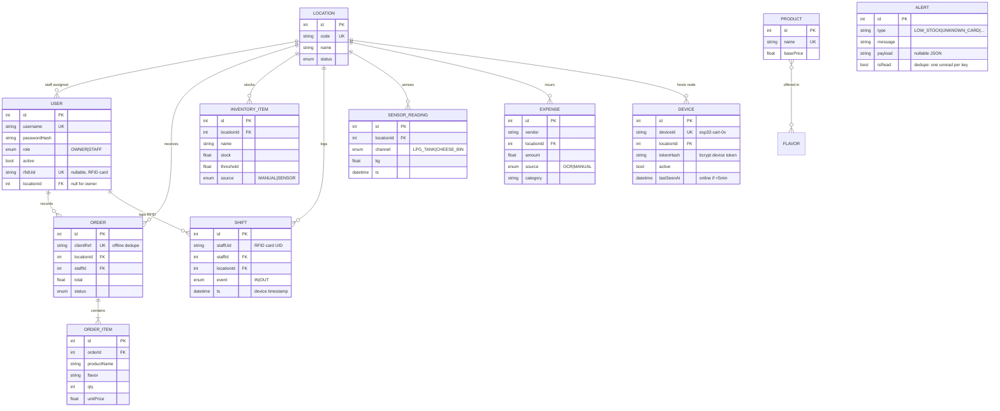

# CartIQ Database Schema

Prisma source of truth: [`api/prisma/schema.prisma`](../api/prisma/schema.prisma)

## Design decisions

- **`Order.clientRef`** (unique): mobile queues orders offline; the UUID lets the
  API reject duplicate replays of the same queued sale.
- **Per-cart inventory rows** (`@@unique([locationId, name])`): each cart owns its
  stock, so offline edits across carts can never conflict (last-write-wins per key).
- **Device timestamps** (`Shift.ts`, `SensorReading.ts`) are taken at the cart,
  not upload time, so delayed batch sync stays historically correct. Firmware
  omits `ts` when NTP is unsynced so the server can default to upload time.
- **Alerts** is a generic feed (low-stock, unknown-card, sensor-drift) the
  dashboard polls; keeps business rules server-side. Low-stock alerts dedupe
  to one unread row per item; unknown-card alerts dedupe per UID.
- **`Device`** registry: one ESP32 node per cart, bearer token bcrypt-hashed
  at rest, `lastSeenAt` updated on every reading/shift, `online = lastSeen < 5min`.
- **Sensor → inventory mapping:** `LPG_TANK` mirrors into the `LPG Tank` row,
  `CHEESE_BIN` into `Cheese Powder` (source flips to `SENSOR`). Recipe-tracked
  items (pouches, frozen packs, powders via `IngredientMap`) deduct on POS orders.
